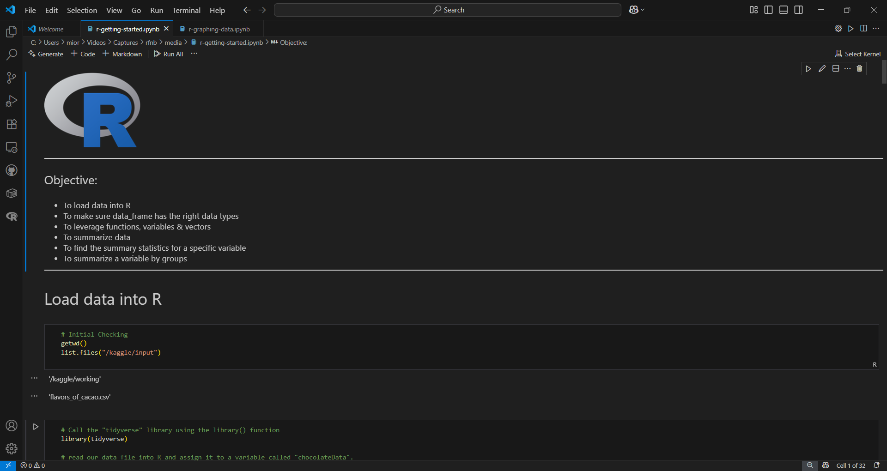
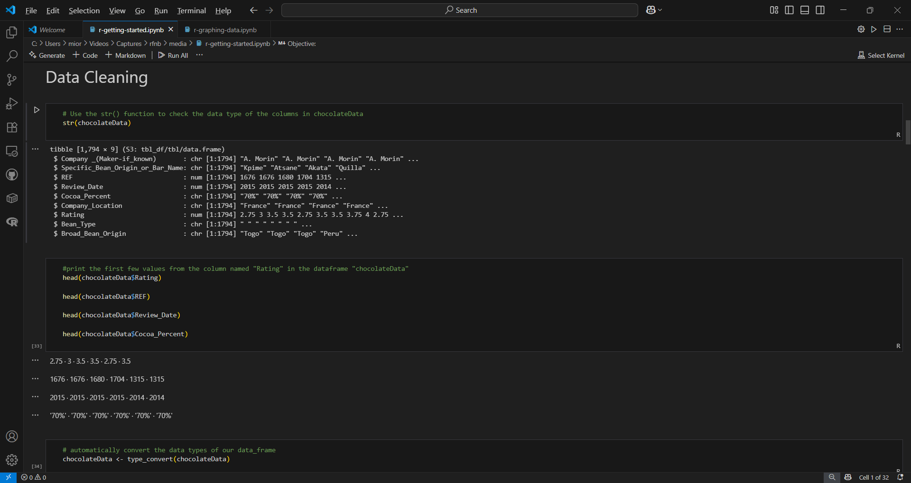
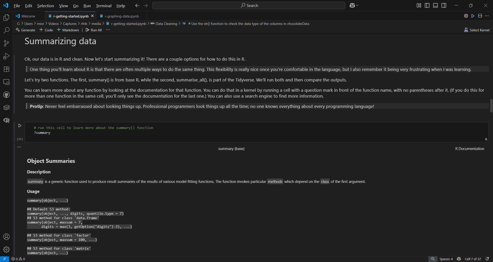
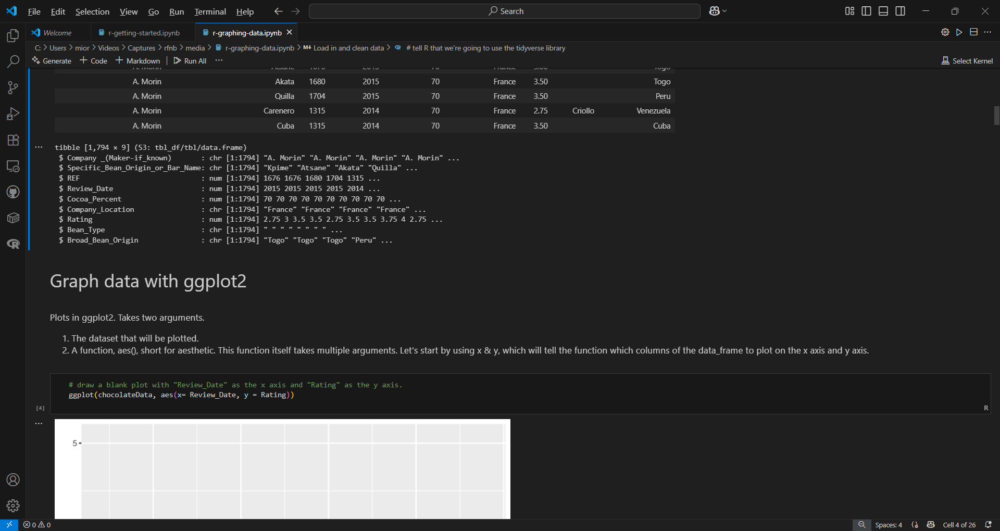
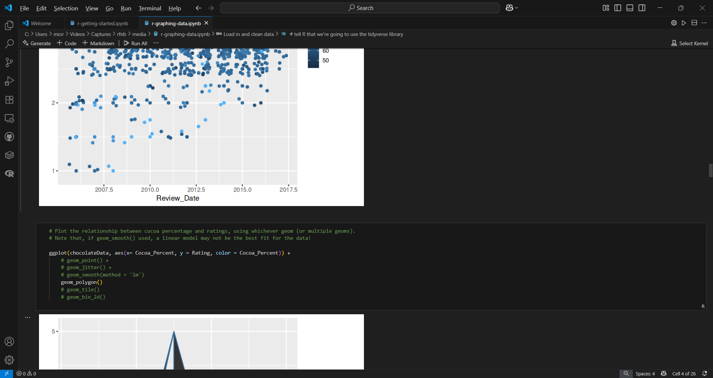
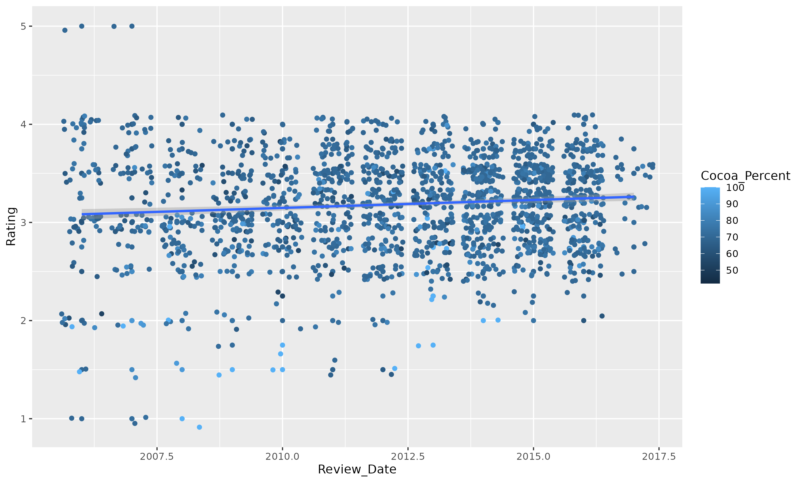
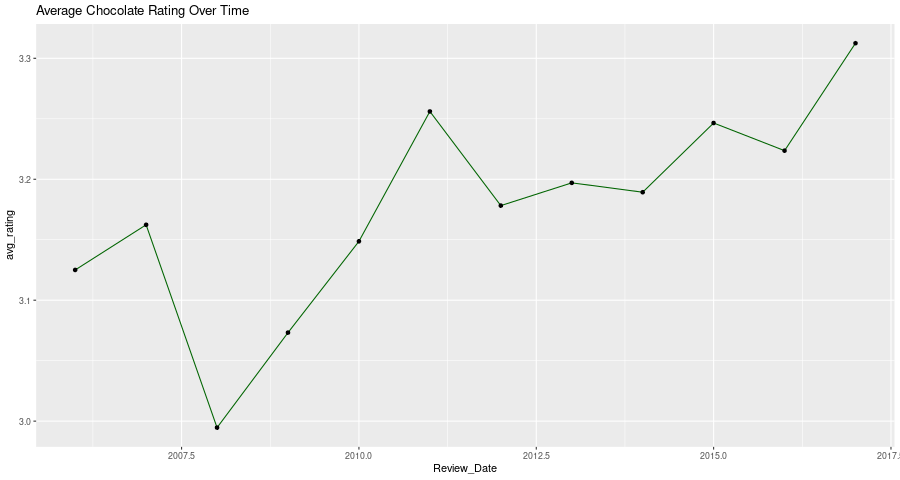
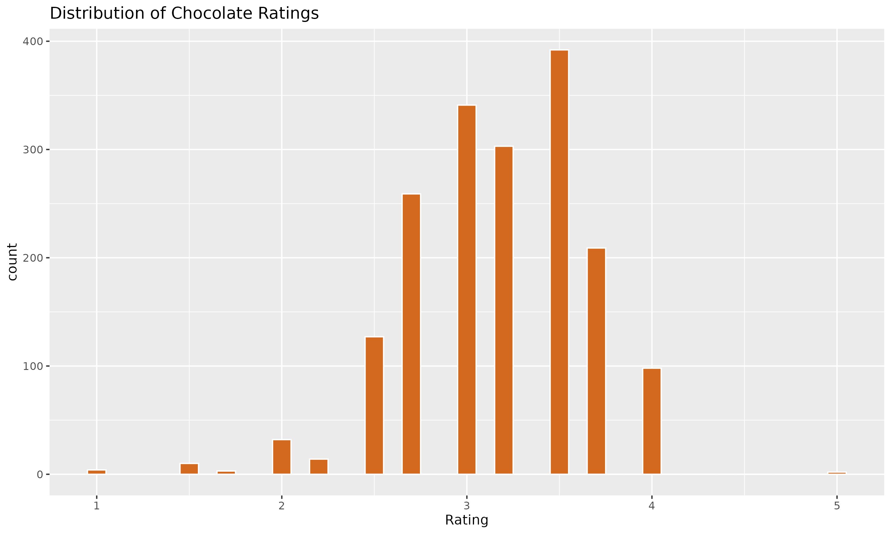

# rfnb
rfnb : Food &amp; Beverage # R Programming Language # tidyverse # ggplot # tibble

## Objective
To perform data load, transform (cleaning, summarize) & visualization using R.

## R F&B

